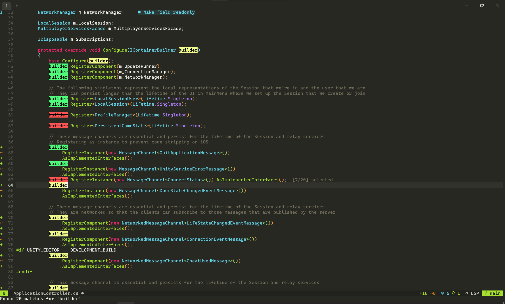

# multiple-cursor.nvim

A lightweight, powerful multi-cursor plugin for Neovim that feels like VS Code's multi-cursor implementation.

<p align="center">
  
</p>

## Features

- **Position-Based Selection**: Select or skip specific matches based on your cursor position.
- **Real-time Sync**: Edits (insert, delete, change) are synchronized across all cursors instantly.
- **Smart Navigation**: `Ctrl+J` / `Ctrl+K` to jump between matches quickly.
- **Auto-Jump**: Automatically moves to the next unselected match after you select or skip one.
- **Preserved State**: Keeps track of skipped matches so you can come back to them.

## 📦 Installation

### Using [lazy.nvim](https://github.com/folke/lazy.nvim)

```lua
{
  "khoido2003/multiple-cursor.nvim",
  keys = {
    { "<C-n>", "<cmd>MultipleCursorStart<cr>", desc = "Start Multiple Cursor" },
  },
  cmd = { "MultipleCursorStart", "MultipleCursorSelectAll" },
  config = function()
    require("multiple-cursor").setup()
  end,
}
```

### Using [packer.nvim](https://github.com/wbthomason/packer.nvim)

```lua
use {
  "khoido2003/multiple-cursor.nvim",
  config = function()
    require("multiple-cursor").setup()
  end,
}
```

### Manual Installation

Clone to your Neovim packages directory:

```bash
git clone https://github.com/khoido2003/multiple-cursor.nvim ~/.local/share/nvim/site/pack/plugins/start/multiple-cursor
```


## Keybindings

| Key | Action | Description |
|-----|--------|-------------|
| `<C-n>` | **Add Cursor** | Adds a cursor to the match under your current cursor position. If no session is active, starts one on the current word. |
| `<C-x>` | **Skip / Remove** | Skips or removes the cursor from the match under your current position. |
| `<C-j>` | **Next Match** | Jump to the next match occurrence. |
| `<C-k>` | **Prev Match** | Jump to the previous match occurrence. |
| `<C-a>` | **Select All** | Selects all remaining matches in the buffer. |
| `c` / `i` / `I` / `A` | **Edit** | Enter edit mode. Changes are synced to all selected cursors. |
| `<Esc>` | **Exit** | Exit multi-cursor mode. |

## Usage Workflow

1. Place your cursor on a word you want to edit.
2. Press `<C-n>` to start. The current word is selected and the cursor jumps to the next match.
3. Use `<C-j>` / `<C-k>` to move between matches if needed.
4. Press `<C-n>` to add more cursors, or `<C-x>` to skip a match.
5. Press `c` (change), `d` (delete), or `i` (insert) to start editing. All selected instances will be updated simultaneously.
6. Press `<Esc>` to finish.

## Configuration

Default configuration:

```lua
require("multiple-cursor").setup({
  keymaps = {
    start_next = "<C-n>",
    skip = "<C-x>",
    next_match = "<C-j>",
    prev_match = "<C-k>",
    select_all = "<C-a>",
    exit = "<Esc>",
  },
  highlights = {
    cursor = "MultipleCursor",
    match = "MultipleCursorMatch",
    current = "MultipleCursorCurrent",
    skipped = "MultipleCursorSkipped",
  },
  highlight_definitions = {
    cursor = { bg = "#50fa7b", fg = "#000000", bold = true }, -- Vivid Green with Black text
    match = { bg = "#f1fa8c", fg = "#000000", bold = true }, -- Bright Yellow with Black text
    current = { bg = "#8be9fd", fg = "#000000", bold = true }, -- Cyan with Black text
    skipped = { bg = "#ff5555", fg = "#000000", strikethrough = true }, -- Red with Black text
  },
  match_whole_word = true,
  case_sensitive = true,
})
```
